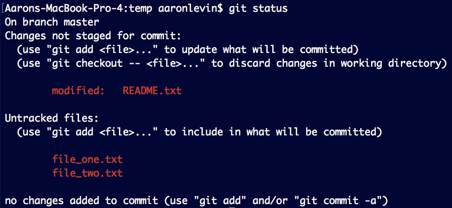
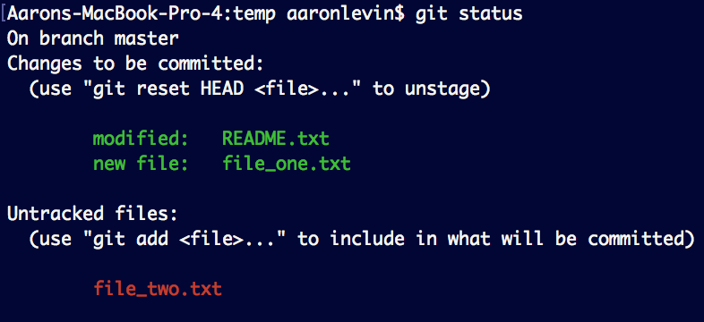

# Version Control and Git
## What is Version Control?
At a high level, Version Control (often abreviated as VCS, or "Version Control System") is just a backup system for programming. Imagine writing some code to make a mobile app. You reach a point where everything works stably, so you want to save your progress. Then you add a new feature that introduces some bugs. You can't present your application to your friends now that it has bugs, so you want to revert back to the stable version of your application. But, your new feature is almost bug-free, so you don't want to lose those changes either. Here's where Version Control comes to the rescue. 

## Git
Git is one of many VCS, and is NOT to be confused with GitHub. The difference is simple: 
* Git is the actual version control software
* GitHub is a website/hosting service for Git repositories

So if my team and I are writing code together, we would all "commit" our changes locally and "push" those changes to GitHub. With the project being hosted on GitHub, developers are free to download, or "clone", their projects on whatever computer they want. You can think of GitHub like Google Drive for remotely saving different iterations of code. 

## Core git Concepts
In order to understand how to use git, you need to know a few definitions.

* Repository
* Staging
* Commit
* Index
* Head
* Branch

### Repository
A git repository is a collection of files in a project that are tracked by git. Think of this as your "working directory" for your project.

If you were on your desktop and ran the following code, you would create a git repository called MyFirstRepository. Simply having a folder named `MyFirstRepository` does not make it a git repository. What makes a folder a git repository is the `git init` command. Before you run the `git init` command, there is nothing but an empty folder when we viewed the directory with `ls -a`. Ater running `git init` and another `ls -a`, we'll see that there is a hidden `.git/` folder. (Side Note: You need the `-a` flag with the `ls` command because that will specify to the `ls` command that it should include  hidden files and folders. Any hidden file or folder will begin with a '.'.)
```
cd ~/Desktop/
mkdir MyFirstRepository
cd MyFirstRepository
ls -a
git init
ls -a
```

The `.git/` folder is what makes a directory a git repository, and is generally placed in the root directory of a project. It contains many helpful things that we will talk about later (including but not limited to): branches, objects, refs, HEAD, index, and config.

### Staging
When you save a snapshot of your project in its current state, that snapshot is called a "commit". But sometimes you have dozens of changes, and you only want to add a few of them to your commit. This is done in a process known as "staging".  

This process starts with a very important command, that is used extremely frequently when working with git. The command is `git status`.  

  

The first thing we see is "On branch master". We'll get to branches later, so you canignore that for now.  

Next, there's a section that says `Changes not staged for commit`, and within that area it says `modified: README.txt`. This means that git is tracking changes we make to README.txt, it notices that we've changed the file since our last commit, and we haven't staged those changes to be captured in our next commit. 

Lastly, the section `Untracked files: ` simply lists us the files that aren't currently under version control-- usually, these are brand new files, and git has never saved them in a previous commit. Let's go ahead and demonstrate how to add files during staging.

It's pretty simple. Just type: `git add <path-to-filename>` to add it to the stage. In our example, we'd use the commands: `git add README.txt` and `git add file_one.txt`.  Shown below is the result of calling `git status` after staging those two files.

  

Tip: if you want to add everything since your last commit to the stage, simply type: `git add .`

Now we're ready to commit our staged changes!  
