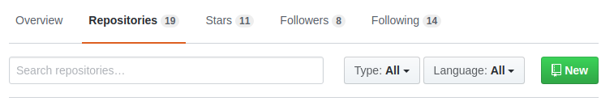
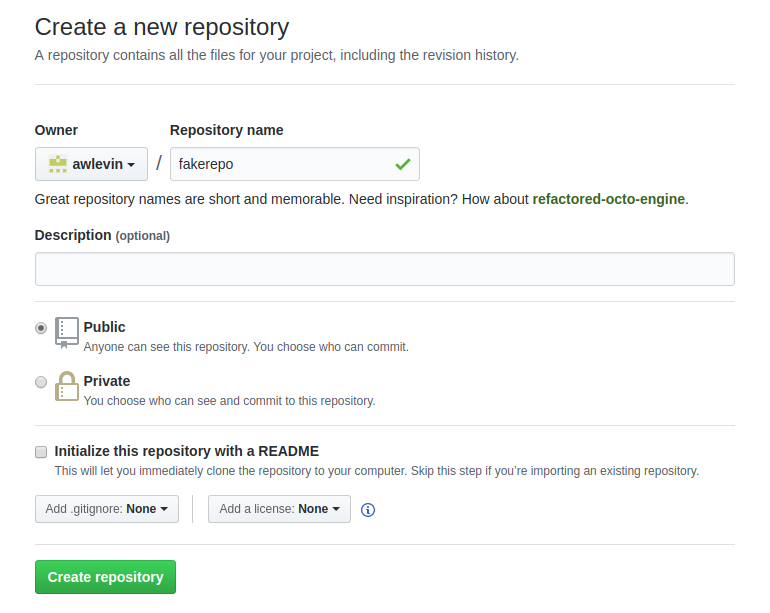
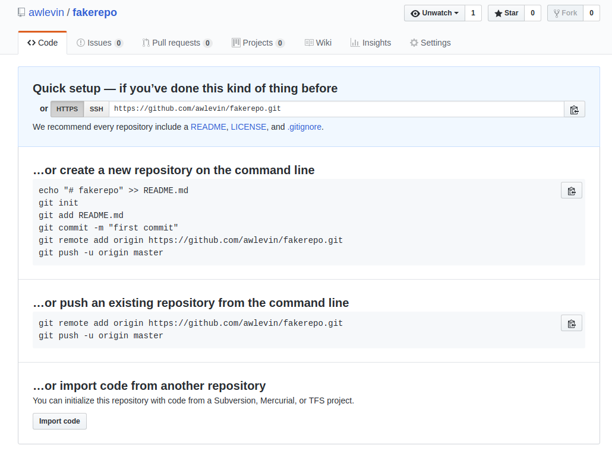
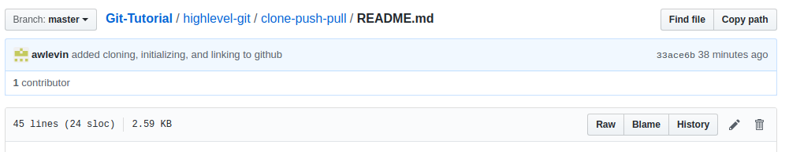

# Using GitHub

## Two Approaches
There are two main approaches to getting a repository up-and-running with GitHub. In short, they are:

1. GitHub-First
2. Local-First

These imply where the repositories are first instantiated. These two approaches are slightly different (the first is marginally easier to setup, but is only viable if you haven't actually started your project yet). Thus, it is up to you, the programmer, to be prepared to handle either scenario!

### Approach #1 (GitHub first, project not yet started)
Head over to GitHub.com and navigate to the "repositories" tab of your profile. You should see a "New" button that looks like this:

Click the button and fill out the details of your repo. We recommend leaving out the README and .gitignore for the sake of simplicity. 

When your empty repository has been created, you should arrive at a screen like this:

Copy the HTTPS URL from the "Quick setup" box and head over to terminal. Type `git clone <insert-URL-here>` and press enter. Your computer will download the "empty" repository, and then you're ready to use it to start creating files, staging them, and committing them under version control!

Quick side note: why did we put "empty" in quotations? Take a second to think about it.

...
1 second later...
...

It's because there's a hidden `.git/` folder in your repository, even though it looks like it's empty! Remember, this folder stores all of the version history for your project!

### Approach #2 (local first, project probably already started)
The second approach is to create a Git repo locally, before pushing it to GitHub. In any folder on your computer (empty or not), type `git init` to create a hidden `.git/` folder that will maintain all of your version history! 

Congrats! You're now perfectly capable of using Git to make commits, branches, etc. But, your project doesn't exist on GitHub yet, so you'll only be able to work on it by yourself, and `git push` won't do much of anything. Sad!

Let's link this baby to GitHub. Head over to GitHub and create your new repository. Copy the HTTPS URL of your new project, and head back to your local repository via the commandline. Simply type `git remote add origin <URL>`, press enter, and you're ready to start pushing and pulling from GitHub!

## Pushing and Pulling

### Pushing

This part is easy, and arguably the most useful part of social coding. A push is when you send your local commits to GitHub. And pull is when you retrieve the remote commits FROM GitHub. Easy enough, right?

Go ahead and make a change to a file in your repository. When you type `git status` it should be obvious that this file was modified and the changes have yet to be committed. Commit these changes and then type `git status` again. It should say that it's 1 commit ahead of `master`. By simply typing `git push`, you can send your commits to your remote repository on GitHub so anyone else can see what you've contributed to the project. Typing `git status` will now say that your branch is up to date with `origin master` (`origin` is just the name of the original repository on GitHub... It's possible to have an `upstream` which is basically copy of the GitHub repository that isn't the original repository itself. But we'll cover that later!)
..* note that you may have to edit the "author" of your commits, so that your profile is attached to the commits you make. This can be done with the following: 
	..* git config --global user.email "user@email.com"
	..* git config --global user.name "<first> <last>"

### Pulling
If you have any text or source code files in your repository, then you can edit and commit them directly through GitHub. In your web browser, navigate to the file you're interested in modifying and click the pen icon (shown below). 

Change something in the file (literally anything), type a commit message, and press the green "Commit changes" button at the bottom".

Now head back to your local repository and type `git status`. It should say "your branch is 1 commit behind origin master". Type "git pull" and it will fetch all of the information from your remote repository on GitHub! Pretty nifty, right?

Unfortunately, this will probably be the easiest committing, pushing, and pulling that you will ever do. In reality, you will have multiple people making commits to the same files at the same time, at which point, GitHub will get confused on which commits it should accept when you push. Thus, you will have to learn the art of resolving merge conflicts. Luckily, we're here to help you with that in the next chapter. 
